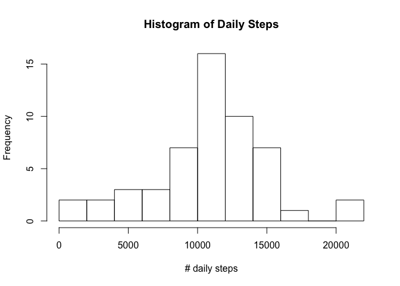
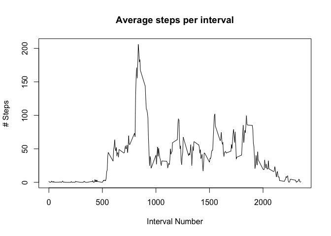
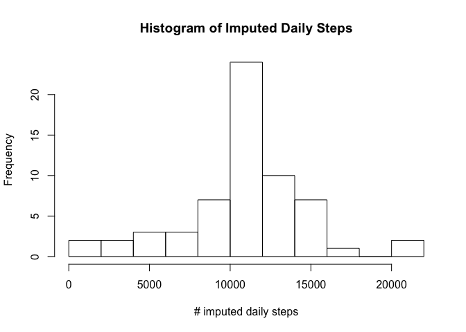
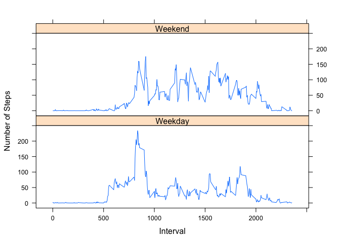

# Reproducible Research: Peer Assessment 1


## Loading and preprocessing the data

```r
activity <- read.csv("activity.csv")
# Do not Filter out all NA data
# activity <- activity[!is.na(activity$steps),]
```

## What is mean total number of steps taken per day?

```r
aggregateStepsByDay <- aggregate(steps ~ date, activity, sum)
hist(aggregateStepsByDay$steps,
     nclass = 10, 
     main = "Histogram of Daily Steps",
     xlab = "# daily steps")
```

<!-- -->

```r
meanAggStepsByDay <- mean(aggregateStepsByDay$steps, na.rm = TRUE)
medianAggStepsByDay <- median(aggregateStepsByDay$steps, na.rm = TRUE)

meanAggStepsByDay <- formatC(meanAggStepsByDay, digits = 1, format = "f")
medianAggStepsByDay <- formatC(medianAggStepsByDay, digits = 0, format = "f")
```

The Mean is 10766.2 and median is 10765


## What is the average daily activity pattern?

```r
meanStepsByInterval <- aggregate(steps ~ interval, activity, mean)
plot(meanStepsByInterval$interval,
     meanStepsByInterval$steps,
     type = "l", 
     main="Average steps per interval", 
     xlab = "Interval Number", 
     ylab="# Steps")
```

<!-- -->

```r
# and now the max
maxSteps <- max(meanStepsByInterval$steps)
maxInterval <- meanStepsByInterval$interval[which.max(meanStepsByInterval$steps)]
maxHours <- maxInterval %/% 100
maxMinutes <- maxInterval %% 100
maxHours <- formatC(maxHours, width = 2, flag = "0")
maxMinutes <- formatC(maxMinutes, width=2, flag = "0")
```

The Maximum of 206.1698113 occurs at interval #835 at 08:35 hours.

## Imputing missing values

```r
# Calculate number of missing values
sum(is.na(activity$steps))
```

```
## [1] 2304
```

```r
missing <- which(is.na(activity$steps))
length(missing)
```

```
## [1] 2304
```

```r
imputedActivity <- activity
# These are dupes, I just want to look at them here and be sure I know what I'm looking at
for(i in missing){
  row <- activity[i,]
  act <- meanStepsByInterval[which(meanStepsByInterval$interval==row$interval),]$steps
  imputedActivity$steps[i] <- act
}
aggregateImputedStepsByDay <- aggregate(steps ~ date, imputedActivity, sum)
hist(aggregateImputedStepsByDay$steps,
     nclass = 10, 
     main = "Histogram of Imputed Daily Steps",
     xlab = "# imputed daily steps")
```

<!-- -->

```r
meanImputedAggStepsByDay <- mean(aggregateImputedStepsByDay$steps)
medianImputedAggStepsByDay <- median(aggregateImputedStepsByDay$steps)

meanImputedAggStepsByDay <- formatC(meanImputedAggStepsByDay, digits = 1, format = "f")
medianImputedAggStepsByDay <- formatC(medianImputedAggStepsByDay, digits = 1, format = "f")
```

The Mean is 10766.2 and median is 10766.2


## Are there differences in activity patterns between weekdays and weekends?

```r
# Add dayType column
activity$dayType <- as.factor(ifelse(
  weekdays(as.Date(activity$date)) %in% c("Saturday", "Sunday"),
  "Weekend", 
  "Weekday"))
meanStepsByIntervalAndDayType <- aggregate(steps ~ interval + dayType, activity, mean)


# Now do the plot
library(lattice)
xyplot(steps~interval | dayType, data = meanStepsByIntervalAndDayType,
      type = 'l',
      xlab = 'Interval',
      ylab = 'Number of Steps',
      layout = c(1,2))
```

<!-- -->

```r
# Get summary data on weekdays:
summary(meanStepsByIntervalAndDayType[meanStepsByIntervalAndDayType$dayType=="Weekday",]$steps)
```

```
##    Min. 1st Qu.  Median    Mean 3rd Qu.    Max. 
##   0.000   2.218  23.970  35.340  51.870 234.100
```

```r
# Get summary data on  on weekends:
summary(meanStepsByIntervalAndDayType[meanStepsByIntervalAndDayType$dayType=="Weekend",]$steps)
```

```
##    Min. 1st Qu.  Median    Mean 3rd Qu.    Max. 
##   0.000   1.107  32.040  43.080  75.570 175.000
```

```r
# Now the moment
maxIntervalWeekday <- meanStepsByIntervalAndDayType$interval[which.max(meanStepsByIntervalAndDayType[meanStepsByIntervalAndDayType$dayType=="Weekday",]$steps)]
maxHoursWeekday <- formatC(maxIntervalWeekday %/% 100, width = 2, flag = "0")
maxMinutesWeekday <- formatC(maxIntervalWeekday %% 100, width=2, flag = "0")

maxIntervalWeekend <- meanStepsByIntervalAndDayType$interval[which.max(meanStepsByIntervalAndDayType[meanStepsByIntervalAndDayType$dayType=="Weekend",]$steps)]
maxHoursWeekend <- formatC(maxIntervalWeekend %/% 100, width = 2, flag = "0")
maxMinutesWeekend <- formatC(maxIntervalWeekend %% 100, width=2, flag = "0")
```
During weekdays the maximum number of steps occurs at interval #835 at 08:35 hours.

During weekend the maximum number of steps occurs at interval #915 at 09:15 hours.
